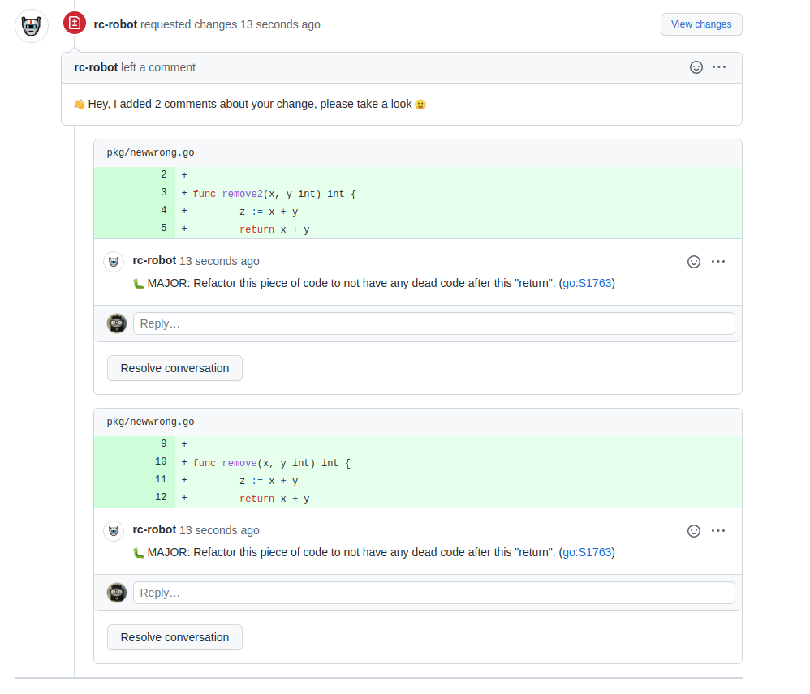
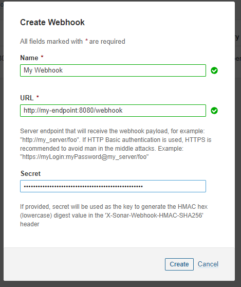

# :robot: Sonarqube PR Issues Review
[![Build Status][ci-img]][ci] [![Coverage Status][cov-img]][cov] [![Go Report Card][report-card-img]][report-card]

Simple Webhook for Sonarqube which publishes the issues found in the PR.


 

The only SCM that is available for now is GitHub, feel free to open a PR if you want to add others.

```shell
$ sqpr
SQPR publishes Sonarqube the issues into your PRs

Usage:
  sqpr [command]

Available Commands:
  cli         Executes CLI commands
  completion  generate the autocompletion script for the specified shell
  help        Help about any command
  server      Executes the server commands

Flags:
  -h, --help   help for sqpr

Use "sqpr [command] --help" for more information about a command.
```

## Getting started
The following environment variables are required:

```
SONAR_API_KEY=SONAR_API_TOKEN
GH_TOKEN=GITHUB_API_TOKEN
SONAR_ROOT_URL=https://sonar-url-without-trailing-slash
WEBHOOK_SECRET=my-hook-secret # Not necessary if CLI
```

To generate a new Sonarqube API Key you can navigate to [https://your-sonar-url/account/security/](https://your-sonar-url/account/security/).

It's possible to use binary directly (check the releases page) OR using the docker container (more info below).


### Webhook
To see the list of all available commands in the server mode run with the `--help` flag:
```shell
$ sqpr server --help
Executes the server commands

Usage:
  sqpr server [command]

Available Commands:
  run         Starts the webhook server

Flags:
  -h, --help              help for server
  -p, --port int          Server port (default 8080)
      --request-changes   When issue is found, mark PR as changes requested (default true)
  -w, --workers int       Workers count (default 30)

Use "sqpr server [command] --help" for more information about a command.
```

Start running the webservice by executing:
```shell
$ sqpr server run
INFO[0000] Listening on port 8080  
```

Now you can add the Webhook into the Sonarqube admin panel using the the `/webhook` endpoint:

 

[!] The **secret** here needs to match the env var `WEBHOOK_SECRET`.

### Using docker
You can also use the docker image instead of running the binary manually:

```yaml
// docker-compose.yml
version: "3"

services:
  webhook:
    image: herlon214/sonarqube-pr-issues:v0.1.6 # Check the latest version
    restart: always
    environment:
      SONAR_API_KEY: my-sonar-api-key
      GH_TOKEN: my-github-token
      SONAR_ROOT_URL: https://sonar-url-without-trailing-slash
      WEBHOOK_SECRET: my-hook-secret
    ports:
      - 8080
```

### CLI
This option is mostly to test, ideally you should use the webhook.

```shell
$ sqpr cli
Executes CLI commands

Usage:
  sqpr cli [command]

Available Commands:
  run         Process the given project and branch

Flags:
      --branch string     SCM branch name (default "my-branch")
  -h, --help              help for cli
      --mark              Mark the issue as published to avoid sending it again
      --project string    Sonarqube project name (default "my-project")
      --publish           Publish review in the SCM
      --request-changes   When issue is found, mark PR as changes requested (default true)

Use "sqpr cli [command] --help" for more information about a command.
```

Processing the issues for one specific project and branch:
```shell
$ sqpr cli run --project myorg_myproject --branch feat/newtest --publish --mark
INFO[0000] Processing myorg_myproject -> feat/newtest 
[OPEN] BUG: pkg/newwrong.go L5:
	- :bug: MAJOR: Refactor this piece of code to not have any dead code after this "return". ([go:S1763](https://sonar-url-without-trailing-slash/coding_rules?open=go:S1763&rule_key=go:S1763))
[OPEN] BUG: pkg/newwrong.go L12:
	- :bug: MAJOR: Refactor this piece of code to not have any dead code after this "return". ([go:S1763](https://sonar-url-without-trailing-slash/coding_rules?open=go:S1763&rule_key=go:S1763))
INFO[0000] Issues review published!
INFO[0000] --------------------------                   
INFO[0000] Mark as published result:                    
INFO[0000] 2 issues marked                              
INFO[0000] 0 issues ignored                             
INFO[0000] 0 issues failed                              
INFO[0000] --------------------------  
```

[doc-img]: http://img.shields.io/badge/GoDoc-Reference-blue.svg
[doc]: github.com/herlon214/sonarqube-pr-issues

[ci-img]: https://github.com/herlon214/sonarqube-pr-issues/actions/workflows/ci.yml/badge.svg
[ci]: https://github.com/herlon214/sonarqube-pr-issues/actions/workflows/ci.yml

[cov-img]: https://codecov.io/gh/herlon214/sonarqube-pr-issues/branch/main/graph/badge.svg?token=q5lsK8I3It
[cov]: https://codecov.io/gh/herlon214/sonarqube-pr-issues/branch/main

[report-card-img]: https://goreportcard.com/badge/github.com/herlon214/sonarqube-pr-issues
[report-card]: https://goreportcard.com/report/github.com/herlon214/sonarqube-pr-issues
